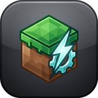

<div align="center">
  
  <h1>OptiLauncher</h1>
  <p><b>An optimized, high-performance fork of PojavLauncher for Android.</b></p>
</div>

---

## 🚀 About OptiLauncher

OptiLauncher is a custom fork of [PojavLauncher](https://github.com/PojavLauncherTeam/PojavLauncher) designed from the ground up for maximum performance and a seamless out-of-the-box experience. 

Unlike the standard launcher, OptiLauncher comes **pre-configured** with the latest optimization mods and performance tweaks, so you can jump straight into the game with the highest framerates possible without spending hours tweaking settings.

## ✨ Key Features

- **Pre-Configured Fabric 1.21.1**: Comes fully prepared with a default Fabric profile, taking the hassle out of manual installations.
- **Built-in Optimization Mods**: Simply drop your favorite optimization mods (Sodium, Lithium, Iris, etc.) into the `assets/custom_mods` directory during the build, and they will be automatically extracted and installed on the first launch!
- **Tuned Java Arguments**: The default JVM arguments are specifically configured to use G1GC with optimized heap region sizes and pause times to eliminate micro-stutters.
- **Custom Branding**: Features a sleek, modern, and distinct new app icon and name (`com.hndrd0.optilauncher`) so it can be installed seamlessly alongside the original PojavLauncher.

## 📥 Installation

1. Go to the [Releases](https://github.com/hndrd0/OptiLauncher/releases) page.
2. Download the latest `app-debug.apk` or `app-release.apk`.
3. Install the APK on your Android device.
4. Launch **OptiLauncher** and log in with your Microsoft account!

## 🛠️ Building from Source

To build OptiLauncher yourself:

1. Clone the repository:
   ```bash
   git clone https://github.com/hndrd0/OptiLauncher.git
   cd OptiLauncher
   ```
2. (Optional) Add your desired `.jar` mods into `app_pojavlauncher/src/main/assets/custom_mods`.
3. Build the APK using Gradle (Requires Java 21):
   ```bash
   ./gradlew assembleDebug
   ```
4. Find the output APK in `app_pojavlauncher/build/outputs/apk/debug/`.

## 📜 License

OptiLauncher is based on PojavLauncher, which is licensed under the **GNU General Public License v3.0**. See the [LICENSE](LICENSE) file for more details.

## 🙏 Acknowledgements

A massive thank you to the [PojavLauncherTeam](https://github.com/PojavLauncherTeam) for creating the amazing foundation that makes playing Minecraft Java Edition on Android possible.
